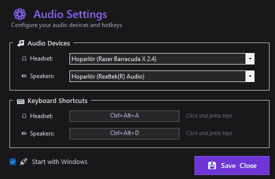

<div align="center">


# 🎛️ SoundDeck

### **Your audio control center — switch devices, manage your microphone and control volume with global hotkeys**

[](https://dotnet.microsoft.com/)
[](https://www.microsoft.com/windows)
[](LICENSE.txt)
[](https://docs.microsoft.com/en-us/dotnet/csharp/)

---

</div>

## 📸 Demo

<div align="center">



**See it in action!** Switch audio devices, toggle your mic and change the volume — all without leaving your game or app.

</div>

---

## 🚀 Features

- 🎧 **Quick Device Switching** — Jump to your headset or speakers instantly
- 🔁 **Output Toggle** — One hotkey to flip between your chosen headset and speakers
- 🎤 **Dual Microphone Switching** — Pick two mics and toggle between them with a single key
- ⌨️ **Global Hotkeys** — Custom keyboard shortcuts that work system-wide
- 🔔 **Notifications** — Visual feedback every time something changes
- 💾 **Auto-Save** — Your preferences are stored automatically
- 🚀 **Startup Option** — Launch automatically with Windows
- 🔄 **Automatic Updates** — New versions install themselves; no need to re-run any setup
- 🎯 **Lightweight** — Runs quietly in the system tray with minimal resources

---

## 🛠️ Built With

| Technology | Purpose |
|------------|---------|
| **[.NET 10](https://dotnet.microsoft.com/)** | Application framework |
| **[C# 14.0](https://docs.microsoft.com/en-us/dotnet/csharp/)** | Programming language |
| **[Windows Forms](https://docs.microsoft.com/en-us/dotnet/desktop/winforms/)** | User interface |
| **[AudioSwitcher.AudioApi.CoreAudio](https://github.com/xenolightning/AudioSwitcher)** | Audio device & volume management |
| **[Velopack](https://velopack.io/)** | Automatic updates & installer |
| **[System.Text.Json](https://docs.microsoft.com/en-us/dotnet/api/system.text.json)** | Settings serialization |
| **Win32 API** | Global hotkey registration |

---

## 📦 Installation

1. Download **`SoundDeck-win-Setup.exe`** from the [latest Release](../../releases/latest)
2. Run it — SoundDeck installs silently and starts in your system tray
3. That's it. No .NET runtime needed (it's bundled), and **future updates install automatically**

> Building from source instead? See [Development](#-development).

---

## 🔄 Automatic Updates

SoundDeck keeps itself up to date — you never have to download and reinstall a setup again.

- On every launch it quietly checks GitHub for a newer version.
- If one is found, it's downloaded in the background and installed **the next time you start the app**.
- You can also trigger it manually: right-click the tray icon → **🔄 Check for Updates...** (this updates and restarts immediately).
- Your settings live in `%AppData%\SoundDeck` and are **always preserved** across updates.

---

## 📖 Usage Guide

### Initial Setup

1. **Open settings** — double-click the tray icon 🎛️ or right-click → ⚙️ Settings
2. **Output** — pick your **Headset** and **Speakers**
3. **Microphone** — pick **Mic 1** and **Mic 2**
4. **Set hotkeys** — click any hotkey box and press your key combo (`Ctrl` / `Alt` / `Shift` + key). Press `Delete` to clear a hotkey.
5. **Start with Windows** (optional) — enable auto-start
6. Click 💾 **Save & Close**

Settings are stored in: `%AppData%\SoundDeck\settings.json`

### What you can bind

| Action | Description |
|--------|-------------|
| 🎧 Switch to Headset | Set your headset as the default output |
| 🔊 Switch to Speakers | Set your speakers as the default output |
| 🔁 Output toggle | Flip between headset and speakers |
| 🎤 Switch to Mic 1 / Mic 2 | Set the chosen microphone as default |
| 🔁 Microphone toggle | Flip between Mic 1 and Mic 2 |

### Switching from the tray

Right-click the tray icon for quick access to output/microphone switching and settings.

---

## ⌨️ Hotkey Configuration

Combine any modifiers with a key:

- **Modifiers**: `Ctrl`, `Alt`, `Shift`
- **Keys**: `A–Z`, `0–9`, `F1–F12`, NumPad keys, `Space`, `Enter`, and more

### Example combinations
```
Ctrl+Alt+H       → Switch to Headset
Ctrl+Alt+S       → Switch to Speakers
Ctrl+Alt+O       → Toggle output (headset ⇄ speakers)
Ctrl+Alt+1       → Switch to Mic 1
Ctrl+Alt+2       → Switch to Mic 2
Ctrl+Alt+M       → Toggle microphone (Mic 1 ⇄ Mic 2)
```

---

## 💻 System Requirements

- **OS**: Windows 10 (1809+) or Windows 11
- **Runtime**: .NET 10.0 Runtime
- **Architecture**: x64 or ARM64
- **Permissions**: Standard user (no admin required)

---

## 🔧 Development

### Prerequisites
- Visual Studio 2022/2026 or the .NET 10.0 SDK
- Windows 10/11

### Build & run

```powershell
# Clone the repository
git clone https://github.com/GokhanGuclu/SoundDeck.git
cd SoundDeck

# Restore, build and run
dotnet restore
dotnet build
dotnet run --project AudioDeviceTrayApp
```

### Regenerating the logo / icon

The app icon and logo are generated from a single script:

```powershell
powershell -ExecutionPolicy Bypass -File assets\make_logo.ps1
```

This produces `assets/logo.png` and `AudioDeviceTrayApp/app.ico`.

### Releasing a new version (auto-update)

Updates are powered by [Velopack](https://velopack.io/), published through GitHub Releases.

**One-time setup** — install the Velopack CLI (version must match the `Velopack` NuGet package, currently `1.2.0`):

```powershell
dotnet tool install -g vpk --version 1.2.0
```

**Each release:**

```powershell
# 1. Build the installer + update packages (bump the version each time)
powershell -ExecutionPolicy Bypass -File assets\build-release.ps1 -Version 1.0.1
```

This creates a `Releases/` folder containing `SoundDeck-win-Setup.exe`, the `*-full.nupkg`
update package, and the release manifest.

```
# 2. Create a GitHub Release tagged v1.0.1 and upload EVERYTHING in the Releases/ folder.
```

> ⚠️ The tag and the `-Version` must match (e.g. tag `v1.0.1` ↔ `-Version 1.0.1`), and the version
> must always increase. Existing users get this update automatically on their next launch.
> First-time users grab `SoundDeck-win-Setup.exe`.

You can also upload straight from the CLI with a [personal access token](https://github.com/settings/tokens):

```powershell
vpk upload github --repoUrl https://github.com/GokhanGuclu/SoundDeck --publish `
    --releaseName "v1.0.1" --tag "v1.0.1" --token <YOUR_GITHUB_TOKEN>
```

### Project structure
```
SoundDeck/
├── README.md
├── LICENSE.txt
├── .gitignore
├── AudioDeviceTrayApp.slnx          # Solution
├── assets/
│   ├── logo.png                     # App logo (for README)
│   ├── audio.gif                    # Demo animation
│   ├── make_logo.ps1                # Logo / icon generator
│   └── build-release.ps1            # Builds the Velopack installer + update packages
└── AudioDeviceTrayApp/              # Project
    ├── Program.cs                   # Entry point
    ├── Form1.cs                     # Main application logic
    ├── Form1.Designer.cs            # Designer generated code
    ├── app.ico                      # Application icon
    ├── setup.iss                    # (legacy) Inno Setup script — superseded by Velopack
    ├── SimpleInstaller.ps1          # (legacy) PowerShell installer — superseded by Velopack
    └── AudioDeviceTrayApp.csproj
```

---

## 🐛 Troubleshooting

**Hotkeys not working?** Another app may be using the same combo — pick a different one.

**Device not switching?** Make sure it's connected and active, then re-select it in settings.

**Volume / mic hotkeys do nothing?** They act on the *current default* device — check your Windows sound settings.

**App not starting with Windows?** Re-enable "Start with Windows" in settings and check Task Manager → Startup.

---

## 📝 License

This project is licensed under the MIT License — see [LICENSE.txt](LICENSE.txt).

---

## 👨‍💻 Author

**Gökhan Güçlü** — created with ❤️ and ☕

If you find SoundDeck useful, consider giving it a ⭐ on GitHub!

---

## 🤝 Contributing

Contributions, issues and feature requests are welcome!

1. Fork the project
2. Create your feature branch (`git checkout -b feature/AmazingFeature`)
3. Commit your changes (`git commit -m 'Add some AmazingFeature'`)
4. Push to the branch (`git push origin feature/AmazingFeature`)
5. Open a Pull Request

---

## 🙏 Acknowledgments

- [AudioSwitcher Library](https://github.com/xenolightning/AudioSwitcher) by @xenolightning
- Icons from Windows Segoe UI Emoji

---

<div align="center">

**If you found this helpful, please ⭐ star this repository!**

[Report Bug](../../issues) · [Request Feature](../../issues) · [View Releases](../../releases)

</div>
